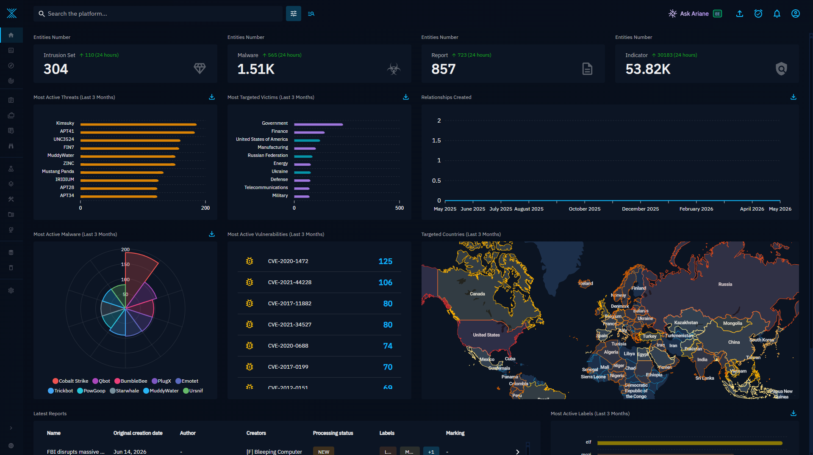

# Wazuh + OpenCTI Threat Intelligence Integration

{.rounded-img}

This project connects a [Wazuh Manager](https://wazuh.com/) to the
[OpenCTI](https://www.opencti.io/) threat‑intelligence platform so that
indicators of compromise (IoCs) detected on your endpoints are checked, in real
time, against your CTI database. When a hash, IP address, domain, hostname or
URL observed by Wazuh matches something stored in OpenCTI, Wazuh raises an
**enriched alert** that carries the indicator name, score, confidence, labels,
marking (TLP), the creating organization and direct links back into the OpenCTI
dashboard.

- :material-shield-search: **IoC Detection**

    ---

    Automatic identification of indicators of compromise on your endpoints.

- :material-database-search: **CTI Enrichment**

    ---

    Queries OpenCTI in real time to retrieve threat intelligence on detected IoCs.

- :material-alert-decagram: **Enriched Alerts**

    ---

    Generates alerts with additional context for faster, better response.

- :material-chart-timeline-variant-shimmer: **Greater Context**

    ---

    More information for SOC analysts and better decision making.

!!! info "What this project adds"
    This integration takes you from basic alerts to alerts contextualized with
    threat intelligence, improving the visibility, prioritization and response
    to security incidents.

## Demo

<iframe src="https://streamable.com/e/xgfh9b" frameborder="0" width="100%" height="100%" allowfullscreen style="width:100%;height:100%;position:absolute;left:0px;top:0px;overflow:hidden;border-radius:0.6rem;box-shadow:0 4px 10px rgba(0,0,0,0.2);"></iframe>

 

## Tested environment

| Component        | Version tested            | Notes                                         |
|------------------|---------------------------|-----------------------------------------------|
| Wazuh Manager    | [**4.14.5**](https://wazuh.com/) | Also verified on earlier 4.x releases |
| OpenCTI          | [**7.2**](https://www.opencti.io/) (and 6.x) | Upstream `misje` targeted 5.12.24 only |
| Sysmon           | **4.90** schema           | Windows endpoints                             |
| Endpoint OS      | Windows 10/11, Linux      | Linux via auditd / packetbeat                 |

## How it fits together

1. An agent forwards an event (a Sysmon detection, a file‑integrity change, a
   DNS query…) to the Manager.
2. A Wazuh rule tags the event with a **group** the integration listens for.
3. The integration extracts the IoC (SHA‑256, IP, domain, hostname or URL) and
   queries OpenCTI over **GraphQL**.
4. If OpenCTI knows the IoC, the script emits a new event that Wazuh turns into
   an **OpenCTI alert** with a severity that depends on the match type.

## Key features

| Capability | juaromu | misje | **This fork** |
|------------|:------:|:-----:|:-------------:|
| Observable lookup | :material-check: | :material-check: | :material-check: |
| Indicator lookup & STIX patterns | :material-close: | :material-check: | :material-check: |
| Event types (match classification) | :material-close: | :material-check: (4) | :material-check: (**6**) |
| OpenCTI version | pre‑5 syntax | 5.12.24 | **6.x / 7.x** |
| Group matching | by position | exact string | **regex (both schemes)** |
| Command‑line IoC extraction (EID 1) | :material-close: | :material-close: | :material-check: **new** |
| `observable_only` alert type | :material-close: | :material-close: | :material-check: **new** |

## Next steps

- :material-clipboard-check: [**Requirements**](requirements.md)

    ---

    Check what you need before installing.

- :material-book-open-variant: [**Step‑by‑step guide**](step-by-step.md)

    ---

    Full walkthrough from zero to a working alert.

- :material-new-box: [**What's new**](whats-new.md)

    ---

    Feature comparison against upstream projects.

!!! warning "Credentials"
    The OpenCTI API token is a sensitive secret. Throughout this documentation it
    is shown as a placeholder (`REPLACE-ME-WITH-A-VALID-TOKEN`). Never commit a
    real token to a public repository or paste it into a published site.
