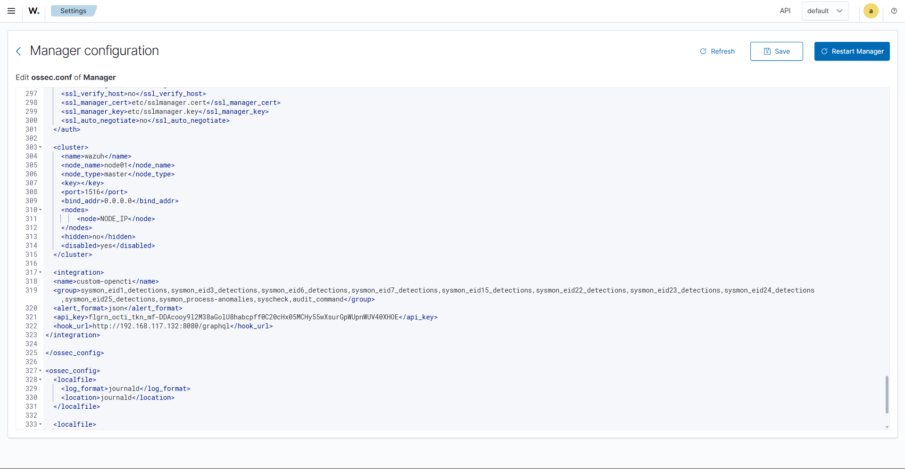

# Manager Configuration

The integration is activated by an `<integration>` block in the Manager's
`ossec.conf`. This tells Wazuh **which events** to forward to the script and
**how** to reach OpenCTI.

## Where to edit

```bash
nano /var/ossec/etc/ossec.conf
```

Or, from the Wazuh dashboard: **Server management → Settings → Edit
configuration**. Add the block below an existing section such as `<cluster>`,
inside an `<ossec_config>` block.

{.rounded-img}

## The integration block

```xml
<integration>
  <name>custom-opencti</name>
  <group>sysmon_eid1_detections,sysmon_eid3_detections,sysmon_eid6_detections,sysmon_eid7_detections,sysmon_eid15_detections,sysmon_eid22_detections,sysmon_eid23_detections,sysmon_eid24_detections,sysmon_eid25_detections,sysmon_process-anomalies,syscheck,audit_command</group>
  <alert_format>json</alert_format>
  <api_key>REPLACE-ME-WITH-A-VALID-TOKEN</api_key>
  <hook_url>http://YOUR_OPENCTI_IP:8080/graphql</hook_url>
</integration>
```

### Parameters

| Parameter | Description |
|-----------|-------------|
| `name` | Integration name — must match the file name (`custom-opencti`). |
| `group` | Comma‑separated rule groups that trigger a lookup. Tailor this to the sources you actually collect. |
| `alert_format` | Must be `json` — the script parses the alert as JSON. |
| `api_key` | Your OpenCTI API token (read permissions). |
| `hook_url` | The OpenCTI **GraphQL** endpoint, ending in `/graphql`. |

!!! warning "Keep the token out of version control"
    `api_key` is a real secret. Use a placeholder in any copy you publish, and
    restrict read access to `ossec.conf` (it is `root:wazuh`, mode `640`, by
    default).

## Choosing the `group` list

The `group` value decides which events are inspected. Match it to your telemetry:

=== "Minimal (FIM only)"

    The native, zero‑extra‑tooling baseline — file hashes from monitored
    directories:

    ```xml
    <group>syscheck</group>
    ```

=== "Windows + Sysmon"

    Full Windows coverage once Sysmon and the [base rules](detection-rules.md)
    are in place:

    ```xml
    <group>sysmon_eid1_detections,sysmon_eid3_detections,sysmon_eid6_detections,sysmon_eid7_detections,sysmon_eid15_detections,sysmon_eid22_detections,sysmon_eid23_detections,sysmon_eid24_detections,sysmon_eid25_detections,sysmon_process-anomalies,syscheck,audit_command</group>
    ```

=== "Linux network sources"

    Add Suricata/packetbeat DNS and audited commands:

    ```xml
    <group>syscheck,ids,audit_command,osquery_file</group>
    ```

!!! note "`group` vs `rule_id`"
    You may use `<rule_id>` instead of `<group>` to trigger on specific rules,
    but you **cannot mix both** — if `<rule_id>` is present, `<group>` is ignored.

## Apply the change

```bash
systemctl restart wazuh-manager
systemctl status wazuh-manager     # confirm it is active
```

➡️ Continue to **[Detection rules](detection-rules.md)** so Wazuh raises alerts
when the script reports a hit.
