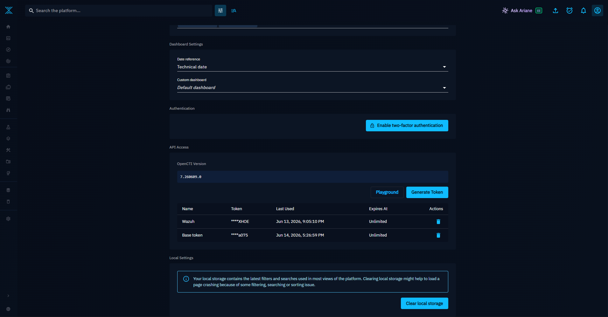
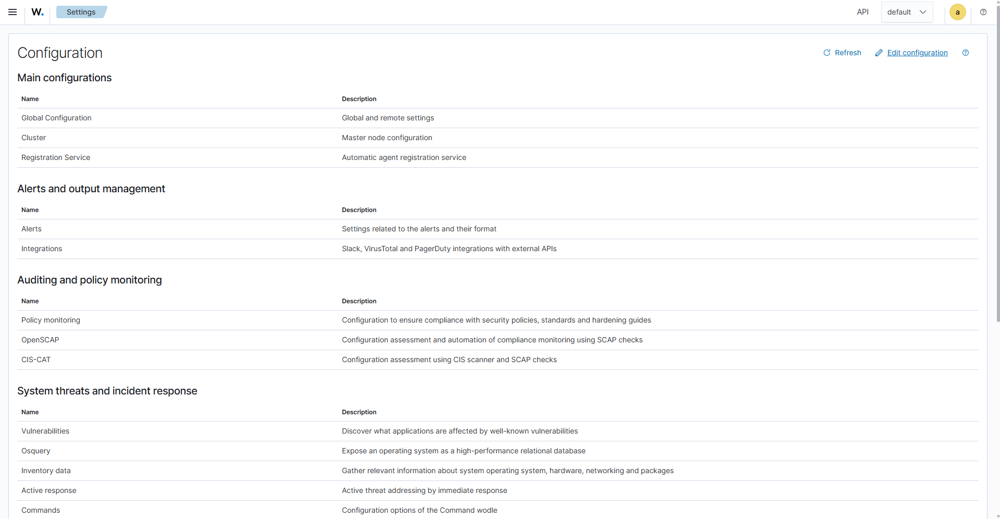
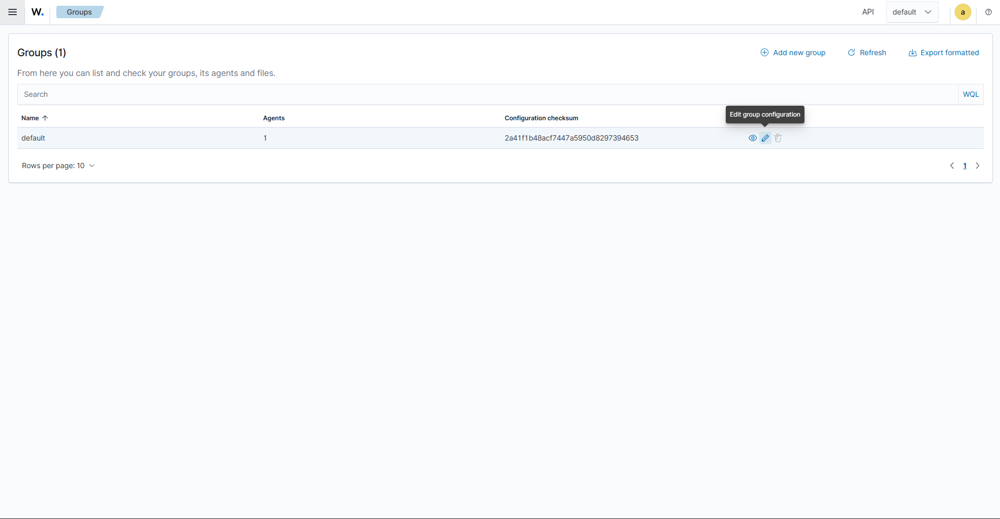
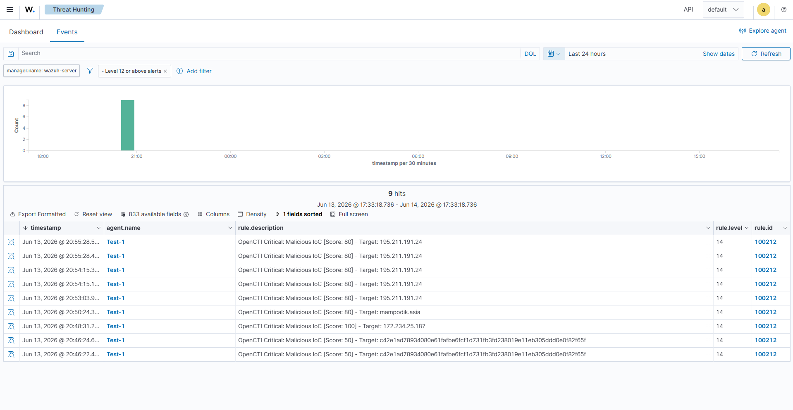
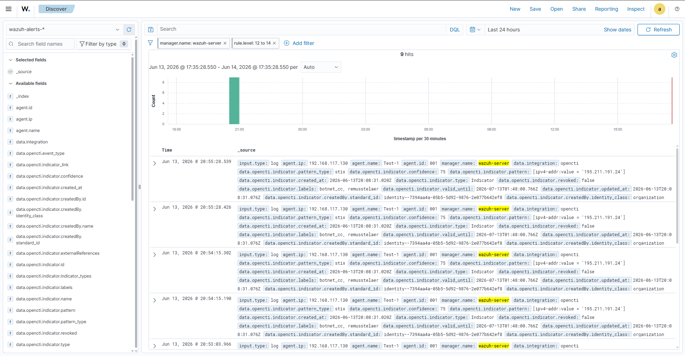

# Step‑by‑Step Guide

A complete walkthrough, from a clean Wazuh + OpenCTI deployment to a working,
enriched threat‑intel alert. It generalizes the FIM‑only procedure to cover
Sysmon and the other sources.

!!! note "Assumptions"
    Wazuh Manager (tested on **4.14.5**) and OpenCTI (tested on **6.x / 7.2**) are
    already installed, running and reachable from each other. You have root on the
    Manager and admin on OpenCTI.

## Step 1 — Get an OpenCTI API token

1. In OpenCTI, open **Profile → API Access**.
2. Copy the **API key**. Keep it secret.

{.rounded-img}

The same page shows the required headers; the script sets them for you.

## Step 2 — Install the integration files

On the Manager:

```bash
cd /var/ossec/integrations

# Download the integration files from GitHub
wget https://raw.githubusercontent.com/enmanuelmartex/wazuh-opencti/main/custom-opencti
wget https://raw.githubusercontent.com/enmanuelmartex/wazuh-opencti/main/custom-opencti.py

chmod 750 custom-opencti custom-opencti.py
chown root:wazuh custom-opencti custom-opencti.py
```

See [Integration files](integration-files.md) for detail.

## Step 3 — Add the detection rules

Edit `/var/ossec/etc/rules/local_rules.xml` (or **Server management → Rules →
`local_rules.xml`**) and add:

- the **OpenCTI threat‑intel rules** (`100210`–`100216`), and
- if you use Sysmon, the **base Sysmon rules** (`100140`–`100149`).

Full XML in [Detection rules](detection-rules.md).

## Step 4 — Configure the integration in the Manager

Edit `/var/ossec/etc/ossec.conf` (or **Server management → Settings → Edit
configuration**) and add, below `<cluster>`:

{.rounded-img}

```xml
<integration>
  <name>custom-opencti</name>
  <group>sysmon_eid1_detections,sysmon_eid3_detections,sysmon_eid6_detections,sysmon_eid7_detections,sysmon_eid15_detections,sysmon_eid22_detections,sysmon_eid23_detections,sysmon_eid24_detections,sysmon_eid25_detections,sysmon_process-anomalies,syscheck,audit_command</group>
  <alert_format>json</alert_format>
  <api_key>REPLACE-ME-WITH-A-VALID-TOKEN</api_key>
  <hook_url>http://YOUR_OPENCTI_IP:8080/graphql</hook_url>
</integration>
```

Trim the `<group>` list to the sources you actually collect (see
[Manager configuration](manager-configuration.md)).

## Step 5 — Configure the data sources

=== "FIM (native, required minimum)"

    On the agent (Agents management → Groups → `default`):

    {.rounded-img}

    ```xml
    <agent_config>
      <syscheck>
        <directories realtime="yes" check_all="yes">C:\Users\user\Downloads</directories>
        <directories realtime="yes" check_all="yes">/media/user/software</directories>
      </syscheck>
    </agent_config>
    ```

    `check_all="yes"` is required so `sha256_after` is present.

=== "Sysmon (Windows)"

    1. Install Sysmon with the project's tuned config:
       ```powershell
       sysmon64.exe -accepteula -i sysmonconfig.xml
       ```
    2. Ship the channel to Wazuh:
       ```xml
       <localfile>
         <location>Microsoft-Windows-Sysmon/Operational</location>
         <log_format>eventchannel</log_format>
       </localfile>
       ```
    3. Ensure the base Sysmon rules are loaded (Step 3).

    Detail in [Sysmon](sysmon.md).

=== "Linux (DNS / commands)"

    Add packetbeat/Suricata for the `ids` group and/or auditd for
    `audit_command`. See [Linux sources](linux-sources.md).

## Step 6 — Restart and verify the service

```bash
systemctl restart wazuh-manager
systemctl status wazuh-manager
```

## Step 7 — Enable debug logging (for the test)

```bash
nano /var/ossec/etc/local_internal_options.conf
# add:
integrator.debug=1

systemctl restart wazuh-manager
```

Watch the integration log in another terminal:

```bash
tail -f /var/ossec/logs/integrations.log
```

You will see queries sent to OpenCTI, the GraphQL responses, connection errors,
and indicators found.

## Step 8 — Create a test IoC in OpenCTI

1. Create an **Observable** of type **File** (or IPv4‑Addr, Domain‑Name…).
2. Add the **SHA‑256** of a harmless test file (or the test IP/domain).
3. Create an **Indicator** and **link it** to the observable.
4. Save.

!!! important "Indicator vs. observable"
    Wazuh raises a **high‑severity** alert (`observable_with_indicator` /
    `indicator_pattern_match`) only when the observable has an indicator attached.
    Without an indicator you will get the **medium** `observable_only` alert
    instead. Add the indicator to test the high‑severity path.

## Step 9 — Generate the event

=== "FIM"

    Get the hash and drop the file in a monitored directory:

    ```powershell
    Get-FileHash .\test.txt -Algorithm SHA256
    # copy the hash into OpenCTI, then move test.txt into e.g. Downloads
    ```

    Wazuh computes the SHA‑256 → the integration queries OpenCTI → an enriched
    alert appears.

=== "Sysmon command line"

    Run a benign command that contains a test IP/URL you registered in OpenCTI:

    ```powershell
    ping.exe <your-test-public-ip>
    ```

=== "DNS"

    Resolve a test domain you registered:

    ```powershell
    Resolve-DnsName <your-test-domain>
    ```

## Step 10 — Confirm the alert

In the Wazuh dashboard, go to **Threat Hunting** (or **Explore → Discover**) and
look for alerts like:

{.rounded-img}

```text
OpenCTI Critical: Malicious IoC [Score: 80] - Target: <indicator name>
```

The alert includes the indicator name, score, confidence, labels, the related
observable, the OpenCTI dashboard URL, and the detected hash / IP / domain.

{.rounded-img}

## Step 11 — Disable debug (production)

Once verified, set `integrator.debug=0` (or remove the line) and restart the
Manager to avoid filling `integrations.log`.

---

If nothing appears, work through
[Testing & troubleshooting](testing-troubleshooting.md).
